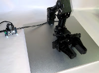
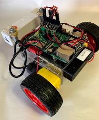
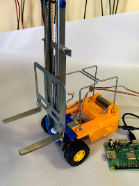

# Mechspace Robots
Source code for robot projects

|Robot||Description|
|-|-|-|
||[Gamestop](gamestop/doc/README.md)|A four-joint OpenMANIPULATOR-X robot arm|
||[Poolcity](poolcity/doc/README.md)|A "wheelie" class two-wheeled robot|
||[Sally](sally/doc/README.md)|A "wheelie" class two-wheeled robot with an extra actuator|
